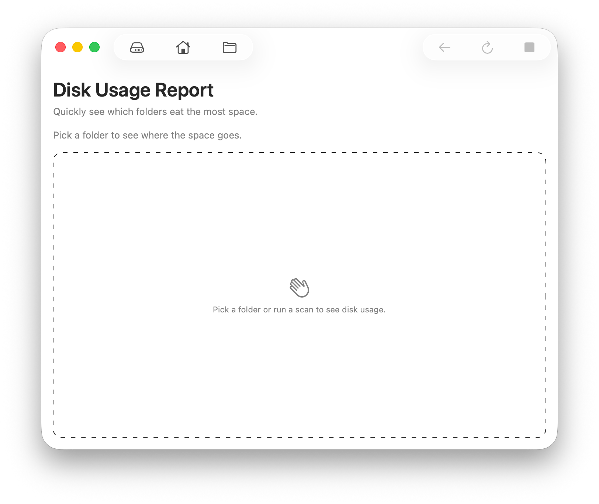
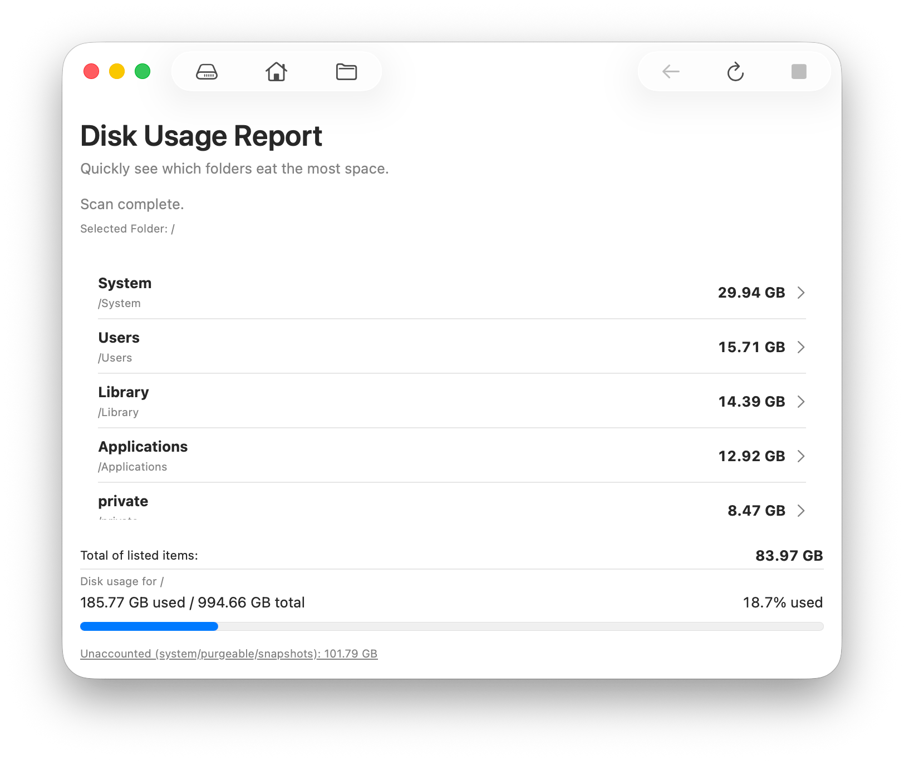

<div align="center">

<picture>
  <source srcset="Documentation/icon-dark.png" media="(prefers-color-scheme: dark)">
  <source srcset="Documentation/icon-light.png" media="(prefers-color-scheme: light)">
  
</picture>
<br/><br/>

<h2>See where your disk space is going — fast & native</h2>
<br>
<p><b>Capacity is a native macOS app</b> that scans any folder (or your whole disk) and shows which top-level items consume the most space. Click to drill down, track totals, and spot unaccounted system usage like snapshots.</p>

</div>

<p align="center">
    <a href="Documentation/App1.png"></a>
    <a href="Documentation/App2.png"></a>
</p>

## Features 
- Scan entire disk, home, or a chosen folder.
- Drill into folders by clicking rows; “Back” to return.
- Refresh current folder to see changes.
- Shows per-item totals plus overall disk used/total with unaccounted system/snapshot space.
- Hidden folders/packages included (e.g., Photos Library).

## Tutorial Summary

### 1. Grant Access (optional but recommended)
- For full accuracy on protected paths, grant Full Disk Access in System Settings > Privacy & Security > Full Disk Access, then relaunch.

### 2. Choose Where to Scan
- Toolbar buttons: Scan Entire Disk, Scan Home Folder, or Choose Folder….
- You can refresh the current folder or click Back to return to the previous level.

### 3. Explore Results
- Click any folder row to drill down; sizes are sorted largest first.
- Totals section shows listed items, disk used/total, and unaccounted space (often Time Machine snapshots/purgeable).
- Click “Unaccounted…” to see tmutil commands for listing or deleting local snapshots.

## 🖥️ Install & Minimum Requirements

- macOS 14.0 or later  
- Apple Silicon & Intel (not tested on Intel)
- ~10 MB free disk space  

### ⚙️ Installation

Download from Releases. It's signed & notarized.

### ⚙️ Build it yourself!

Clone the repo and build with Xcode:

```bash
git clone https://github.com/gbabichev/Capacity.git
```

## 📝 Changelog

### 1.0.0
- Initial release: scan any folder/disk, drill down, back navigation, refresh, totals with unaccounted system space helper.

## 📄 License

MIT — free for personal and commercial use. 
